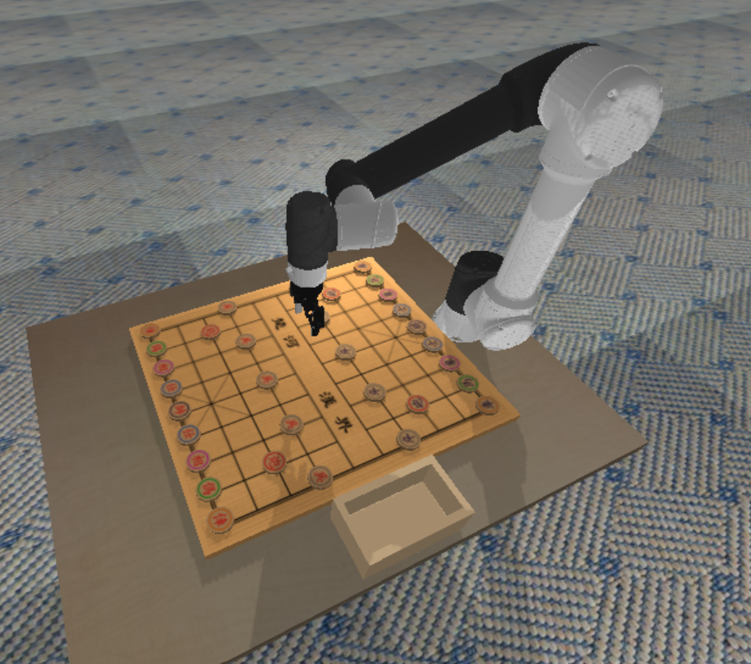

# Autonomous XiangQi-Playing Robot

## Overview

This project integrates robotics and AI to develop an autonomous system capable of playing **Xiangqi** (Chinese Chess). The system uses a **6-DOF UR5e robotic arm** with a **Robotiq gripper** for precise manipulation of Xiangqi pieces. It employs **Pikafish**, an open-source Xiangqi engine, for decision-making and gameplay strategy. The project focuses on real-world applications in robotic game-playing, highlighting human-robot interaction and motion planning for handling complex tasks.

## Project Structure

The project is organized into the following key components:

- **Robot Model**: A UR5e robotic arm with a Robotiq gripper, capable of performing accurate, collision-free movements to manipulate Xiangqi pieces.
- **Game Engine**: Pikafish, an open-source Xiangqi engine, used for move calculation and evaluation.
- **Motion Planning**: The arm uses two motion planning algorithms (Pick-and-Place and Rapidly-exploring Random Tree) to plan collision-free paths for piece manipulation.
- **Piece Classification**: Object recognition and classification are handled using PyBullet’s 3D camera and segmentation mask, with image processing in OpenCV.
- **Chess Pieces and Board Design**: Xiangqi chess pieces and the board are modeled using Blender, with color-coded pieces for improved visibility in computer vision tasks.

## Features

- **6-DOF Manipulation**: The UR5e robot arm with a Robotiq gripper allows for smooth and accurate manipulation of Xiangqi pieces.
- **Collision-Free Path Planning**: The Pick-and-Place and RRT algorithms ensure safe and accurate movement of the robot arm.
- **AI-Driven Decision Making**: The Pikafish engine powers move calculation and board evaluation, driving the robot’s decision-making in Xiangqi.
- **Piece Recognition**: A fixed overhead camera and segmentation mask allow for precise piece identification using computer vision techniques.
- **Simulated Gameplay**: The system was tested in PyBullet for realistic simulation of gameplay, including move execution and piece handling.

## Installation

1. Create a new Anaconda environment: `conda create -n xiangqi python=3.10`

1. Activate the environment: `conda activate xiangqi`

1. Install pip dependencies: `pip3 install "numpy<2" opencv-python`

1. Install conda dependencies: `conda install conda-forge::pybullet`

1. (If you do not already have the codebase) `git clone git@github.com:aureliony/CS4278-Project.git`

## Run the simulation

Run the simulation (Pikafish vs. Pikafish) with the command `python -m simulation.chess`.

To play as red against Pikafish, run `python -m simulation.chess --humans 1`.

To play against yourself or a friend, run `python -m simulation.chess --humans 2`.

## References

PyBullet Documentation: <https://pybullet.org/wordpress/index.php/forum-2/>

You can also use ChatGPT or Cursor to get the API of PyBullet.
