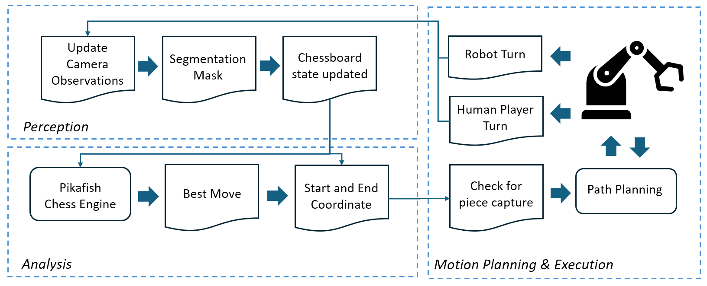

# Autonomous Xiangqi-Playing Robot

## Overview

This project integrates robotics and AI to develop an autonomous system capable of playing **Xiangqi** (Chinese Chess). The robot system is based on a **6-DOF UR5e robotic arm** with a **Robotiq 2F-85 gripper** for precise manipulation of Xiangqi pieces.

The robot uses the **Pikafish** open-source Xiangqi engine to determine optimal moves. Our focus is on real-world applications in robotic game-playing, human-robot interaction and motion planning.

## Project Structure

- **Robot Model**: A UR5e robotic arm with a Robotiq 2F-85.
- **Game Engine**: Pikafish, an open-source Xiangqi engine, used for move calculation and evaluation.
- **Motion Planning**: Simple Pick-and-Place, and Rapidly-exploring Random Trees (RRT).
- **Piece Classification**: PyBullet’s 3D camera and segmentation mask, with image processing in OpenCV.
- **Chess Pieces and Board Design**: Modeled using Blender, with color-coded pieces for improved visibility in computer vision tasks.

## Installation

1. Create a new Anaconda environment: `conda create -n xiangqi python=3.10`

1. Activate the environment: `conda activate xiangqi`

1. Install pip dependencies: `pip install "numpy<2" opencv-python`

1. Install conda dependencies: `conda install conda-forge::pybullet`

1. Clone this repository: `git clone https://github.com/aureliony/CS4278-Project.git`

## Run the simulation

Run the simulation (Pikafish vs. Pikafish) with the command `python -m simulation.chess`

To play as red against Pikafish, run `python -m simulation.chess --humans 1`

To play against yourself or a friend, run `python -m simulation.chess --humans 2`

## References

[PyBullet Documentation](https://pybullet.org/wordpress/index.php/forum-2/)

[Robotiq 2F-85 Manual](https://assets.robotiq.com/website-assets/support_documents/document/2F-85_2F-140_Instruction_Manual_e-Series_PDF_20190206.pdf)
